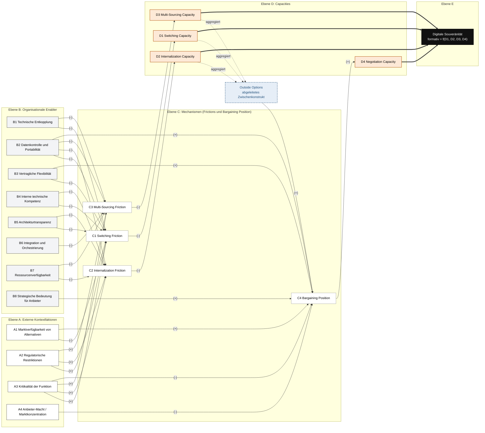

# Digital Sovereignty Model (v9)

## Zielkonstrukt

**Digitale Souveränität auf Organisationsebene** ist die Fähigkeit einer Organisation, bei kritischen digitalen Funktionen auch unter externer Abhängigkeit einen kontrollierten Handlungsraum aufrechtzuerhalten. Sie wird operationalisiert als **formative Aggregation von vier Capacities**: Switching, Internalization, Multi-Sourcing und Negotiation.

## Kausallogik (5 Ebenen)

Externe Kontextfaktoren + Organisationale Enabler → Frictions / Bargaining Position → Capacities → Digitale Souveränität.

- **Ebene A, Kontextfaktoren:** externe, nur begrenzt beeinflussbare Rahmenbedingungen
- **Ebene B, Enabler:** intern gestaltbare organisationale Voraussetzungen
- **Ebene C, Mechanismen:** Übersetzung in Handlungsfriktion (Friction) oder Machtposition (Bargaining Position)
- **Ebene D, Capacities:** die eigentlichen organisationalen Fähigkeiten
- **Ebene E, Digitale Souveränität:** aggregierter Handlungsraum

## Gesamtmodell

## Legende

| Symbol | Bedeutung |
| --- | --- |
| `(+)` / `(-)` | Direkter Effekt mit Vorzeichen. `(-)` bedeutet inverse Wirkung (z. B. mehr Friction, weniger Capacity). |
| durchgezogener Pfeil | gerichteter Effekt |
| gestrichelter Pfeil | Aggregation zu Outside Options |
| dicker Pfeil `==>` | formative Aggregation (Capacity zu Digitaler Souveränität) |

## Treiber je Capacity

Welche Kontextfaktoren und Enabler welche Capacity formen (verifiziert gegen die Kausalformen §6.1 bis §6.4):

| Capacity | Kontextfaktoren | Enabler |
| --- | --- | --- |
| **Switching** | A1, A2, A3 | B1, B2, B3, B4, B5 |
| **Internalization** | A2, A3 (+ technologische Komplexität) | B2, B4, B5, B7 |
| **Multi-Sourcing** | A1, A2, A3 | B1, B2, B6, B7 |
| **Negotiation** | A1, A3, A4 | B2, B3, B8 (+ Outside Options) |

Zwei Muster: **A3 Kritikalität** wirkt auf alle vier Capacities (universeller Kontextfaktor), **B2 Datenkontrolle** ist der einzige Enabler, der alle vier formt (höchster Hebel).

## Konstrukttypen (Messung, §7)

| Reflektiv gemessen | Formativ gebildet |
| --- | --- |
| Switching / Internalization / Multi-Sourcing Friction | Digitale Souveränität (aus D1 bis D4) |
| Bargaining Position | Outside Options (aus D1, D2, D3) |
| Switching / Internalization / Multi-Sourcing / Negotiation Capacity | ggf. Datenkontrolle und technische Entkopplung als Index |

## Die vier Capacities (Kurzdefinition)

- **Switching Capacity:** einen Anbieter in akzeptabler Zeit und mit vertretbarem Risiko ersetzen
- **Internalization Capacity:** eine kritische Funktion intern aufbauen oder selbst betreiben
- **Multi-Sourcing Capacity:** mehrere Anbieter parallel und kontrolliert nutzen
- **Negotiation Capacity:** Preise, Vertragsbedingungen, Datenrechte und Governance aktiv beeinflussen
